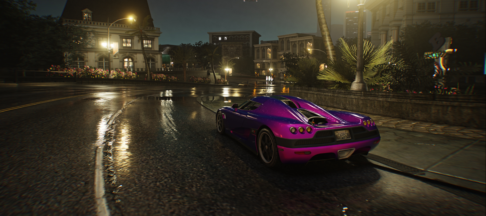
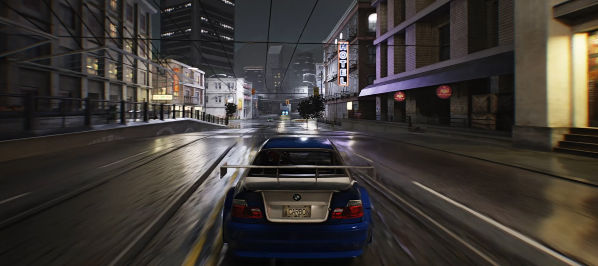

<h1 align="center">NFS Carbon - RTX Remix Compatibility Mod</h1>

 

 

A mod to make NFSC more compatible with NVIDIA's [RTX Remix](https://github.com/NVIDIAGameWorks/rtx-remix).  

If you want to support my work,   
consider buying me a [Coffee](https://ko-fi.com/xoxor4d) or by becoming a [Patreon](https://patreon.com/xoxor4d)

Feel free to join the discord server: https://discord.gg/FMnfhpfZy9

 

### Installing
Grab the latest [Release](https://github.com/xoxor4d/nfsc-rtx/releases) and follow the instructions found there

 

#### Features:

- Custom [Remix Runtime](https://github.com/xoxor4d/dxvk-remix/tree/game/nfsc_1) with:
  - custom car paint shader
  - dynamic wetness code with puddles, raindrops, occlusion checking ..
  - per drawcall tweaks

- Logic to aid with drawcall modifications
- Anti Culling code + per mesh adjustable preculling (occlusion)
- FF rendering in shadermode 1
- ImGui menu to tweak settings and for debugging purposes

 

> [!IMPORTANT] 
> Recommended remix mod: https://www.moddb.com/mods/nfsc-remix-01-beta/downloads/nfsc-remix-012  
> ! **ONLY** extract `nfsc_remix` from `to the main\rtx-remix\mods\` to `your_game\rtx-remix\mods\`  
> ! **Do NOT** extract anything else

 

 

#### Cons:
- Autosculpt does not work (something on remix' side)
- Large amount of drawcalls (also dues to anti culling) can result in a cpu bottleneck

 

## Compiling
- Clone the repository `git clone --recurse-submodules https://github.com/xoxor4d/nfsc-rtx.git`
- Optional: Setup a global path variable named `NFSC_ROOT` that points to your game folder
- Run `generate-buildfiles_vs22.bat` to generate VS project files
- Compile the mod

- Copy everything inside the `assets` folder into the game directory.  
- Go into your `game/.trex` folder and unzip `d3d9_runtime.zip`
- If you did not setup the global path variable:  
  Move the `asi` file into a folder called `plugins` inside your game directory.

 

##  Credits
- [NVIDIA - RTX Remix](https://github.com/NVIDIAGameWorks/rtx-remix)
- [People of the showcase discord](https://discord.gg/j6sh7JD3v9) - especially the nvidia engineers ✌️
- [Dear ImGui](https://github.com/ocornut/imgui)
- [minhook](https://github.com/TsudaKageyu/minhook)
- [Ultimate-ASI-Loader](https://github.com/ThirteenAG/Ultimate-ASI-Loader/releases/tag/v9.7.0)
- [MaxHwoy - hyperlinked](https://github.com/MaxHwoy/hyperlinked)
- [xan1242 - XNFS-ShaderLoader-Carbon](https://github.com/xan1242/xnfs-shaderloader-carbon)
- [ThirteenAG - Widescreen Fix](https://fusionfix.io/wfp#nfsc)
- [nlgzrgn- HUD Adapter](https://nfsmods.xyz/mod/364)
- [Archie - Help/Guiding](https://github.com/ArchieGoldmill)
- [galagandaniloff - remix mod](https://www.moddb.com/mods/nfsc-remix-01-beta)

 

And of course, all my fellow Ko-Fi and Patreon supporters  
and all the people that helped along the way!

